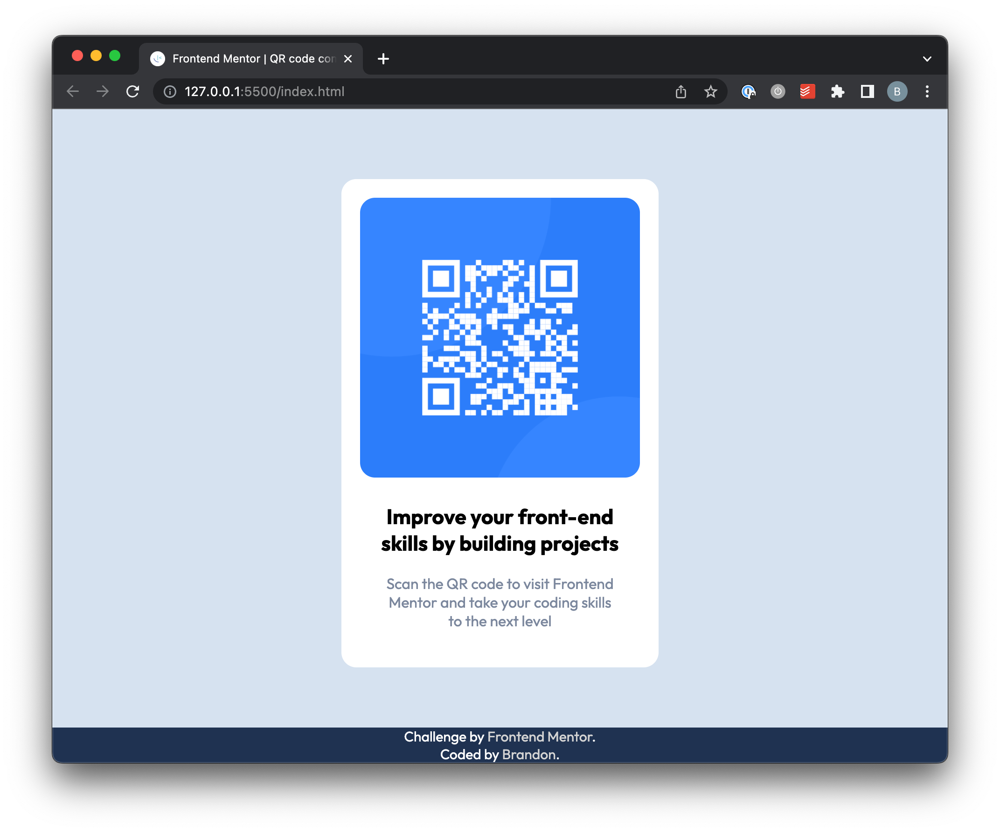

# Frontend Mentor - QR code component solution

This is a solution to the [QR code component challenge on Frontend Mentor](https://www.frontendmentor.io/challenges/qr-code-component-iux_sIO_H). Frontend Mentor challenges help you improve your coding skills by building realistic projects.

## Table of contents

- [Overview](#overview)
  - [Screenshot](#screenshot)
  - [Links](#links)
- [My process](#my-process)
  - [Built with](#built-with)
  - [What I learned](#what-i-learned)
  - [Continued development](#continued-development)
- [Author](#author)

## Overview

This is my first challenge attempt for Frontend Mentor. The task was to recreate the QR-code card using only a .jpg of a mobile and desktop design.

### Screenshot

### Links

- Solution URL: [Add solution URL here](https://your-solution-url.com)
- Live Site URL: [Add live site URL here](https://fem-qr-code-bmm.netlify.app)

## My process

I first began this project by building my HTML using semantic markup (even though it's just a single card). My first attempt was to use CSS, but I didn't quite feel comfortable using it, so I went back to LESS (which is what I'm used to).

### Built with

- Semantic HTML5 markup
- LESS
- Mobile-first workflow

### What I learned

I struggled to find the em values to use only referring to a jpg of the design. The more practice and repetition, the better I will become at eyeballing a design and being able to achieve the desired outcome. Using a Figma file would take a lot of the guesswork out and save valuable time for larger-scaled projects.

### Continued development

Use this section to outline areas that you want to continue focusing on in future projects. These could be concepts you're still not completely comfortable with or techniques you found useful that you want to refine and perfect.

## Author

- Website - [Add your name here](https://www.your-site.com)
- Frontend Mentor - [@brandonmartino](https://www.frontendmentor.io/profile/brandonmartino)
